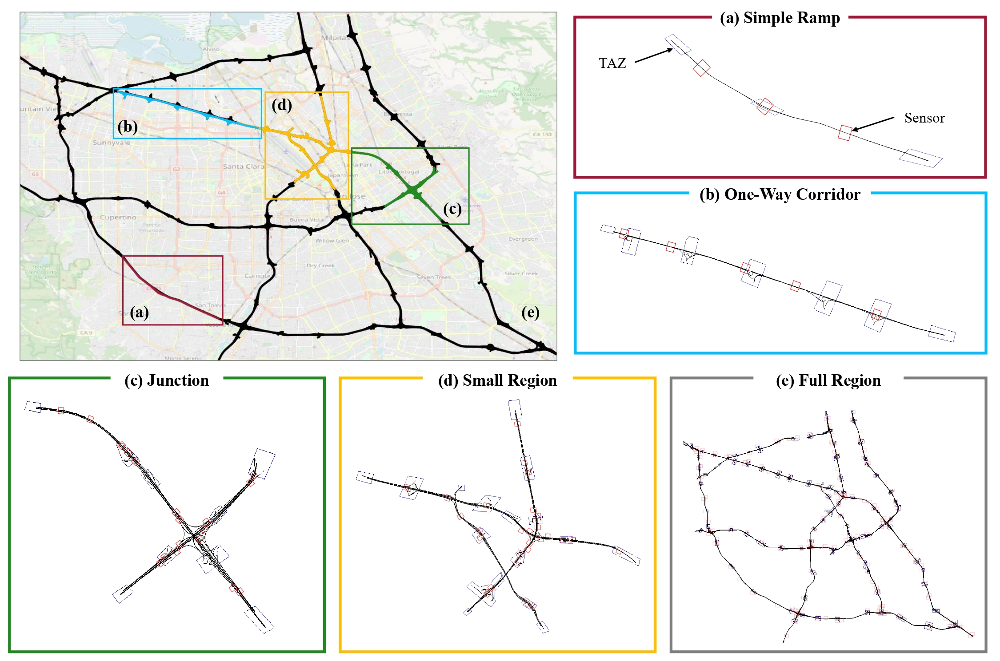
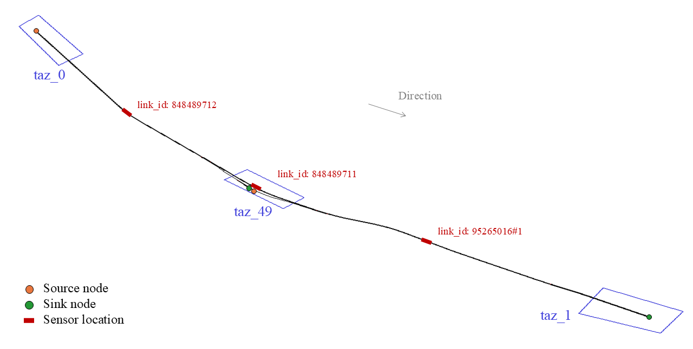
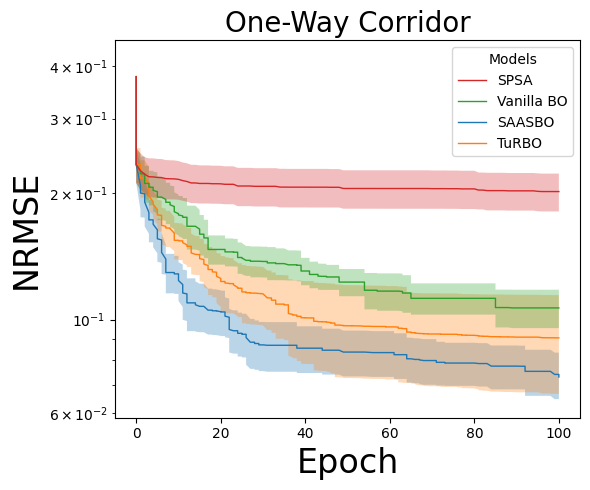
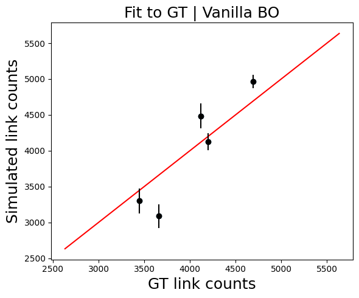

This repository presents benchmarks for evaluating Bayesian Optimization (BO) methods in high-dimensional, real-world urban mobility settings — specifically, origin-destination (OD) estimation in traffic simulations.

- **Simulation backend**: [SUMO (Simulation of Urban Mobility)](https://www.eclipse.org/sumo/)
- **Task**: Estimate OD demand that minimizes the gap between simulated and ground-truth traffic sensor data
- **Scope**: Includes multiple network scales and four optimization strategies

**Benchmark Networks 🛣️**

The benchmark includes five traffic network scenarios of increasing complexity:

<details>
<summary>Click to view network image</summary>

<p align="center">
  
</p>

</details>

- **1ramp**: A minimal linear freeway with a single on-/off-ramp — ideal for validating model logic.
- **2corridor**: A one-way corridor with multiple ramps and OD overlaps — tests flow propagation handling.
- **3junction**: A freeway junction with intersecting flows — tests handling of merging, congestion, and flow splits.
- **4smallRegion**: A compact region with multiple corridors and junctions — emphasizes spatial interaction.
- **5fullRegion**: A full-scale metropolitan freeway system — challenges scalability and generalization.

**Optimization Methods 🎯**

This benchmark supports the following OD estimation strategies:

- **SPSA**: Simultaneous Perturbation Stochastic Approximation
- **Vanilla BO**: Bayesian Optimization with standard GP
- **SAASBO**: Sparse Axis-Aligned Subspace Bayesian Optimization
- **TuRBO**: Trust Region Bayesian Optimization

**Data repository**

The dataset is also included in this repository: [https://github.com/UMN-Choi-Lab/BO4Mob_dataset](https://github.com/UMN-Choi-Lab/BO4Mob_dataset)

---

## ⚙️ Installation

You can install and run this project using one of the following environments:

<details>
<summary><strong>🐳 Docker (Recommended)</strong></summary>
 This is the easiest and most reproducible way to run the benchmark.

### 🛠️ Step-by-Step

1. **Pull the Docker image from Docker Hub**  
    ```bash
    docker pull choisumn/bo4mob
    ```
2. **Run the Docker container**
   ```bash
   docker run -it --name container_name choisumn/bo4mob
   ```
   Attach to the running container and go to the `/app` directory.
3. **Initialize submodules (if needed)**

    When you run the docker container, SUMO is automatically installed. If the submodule does not work, run the following code:

   ```bash
   git submodule init
   git submodule update  
   ```

3. **Initialize submodules (if needed)**

    You can verify the default installation path by running:

    ```bash
    which sumo
    ```

    This should return the path `/opt/sumo-1.12/bin/sumo`.
   

</details>


<details> <summary><strong>🐧 Linux (Manual setup)</strong></summary>
 Follow this guide if you want to run outside Docker on Ubuntu or similar distributions.

### 🛠️ Step-by-Step

- This guide outlines how to set up the environment and build the project on **Ubuntu 22.04** with **Python 3.10**.

1. **System update & Python installation**

    ```bash
    sudo apt update && sudo apt upgrade -y
    sudo apt install -y python3 python3-pip
    ```

2. **Install required system libraries**
    ```bash
      sudo apt install -y \
          bash \
          curl \
          vim \
          git \
          cmake \
          g++ \
          build-essential \
          libxerces-c-dev \
          libfox-1.6-dev \
          libgdal-dev \
          libproj-dev \
          libgl2ps-dev \
          libsqlite3-dev \
          python3-dev
    ```

3. **Clone the project repository**
    ```bash
      git clone https://github.com/UMN-Choi-Lab/BO4Mob.git
      cd bo-urbanmobility-test
    ```

4. **Install Python dependencies**
    ```bash
      pip install --no-cache-dir -r requirements.txt
    ```

5. **Install and build SUMO**
  - Initialize submodules:
    ```bash
      git submodule init
      git submodule update 
    ```
  - Build SUMO:
    ```bash
      cd sumo/build
      cmake -DCMAKE_INSTALL_PREFIX=/opt/sumo-1.12 ..
      make -j$(nproc)
      sudo make install
    ```
  - Set environment variables:
    ```bash
      echo 'export SUMO_HOME=/opt/sumo-1.12/share/sumo' >> ~/.bashrc
      echo 'export PATH=$PATH:/opt/sumo-1.12/bin' >> ~/.bashrc
      source ~/.bashrc
    ```

6. **(Optional) If python Command Is Not Recognized**
  - If python is not mapped to python3, create the alias manually:
    ```bash
      sudo update-alternatives --install /usr/bin/python python /usr/bin/python3 1
    ```

7. ✅ **Done**
  - You can now run and test your project. To verify SUMO installation:
    ```bash
    which sumo
    ```
    This should return the path `/opt/sumo-1.12/bin/sumo`.


</details>


<details>
<summary><strong>🪟 Windows (Manual setup)</strong></summary>
Follow these steps to set up and run the benchmark on Windows without using Docker.

### 🛠️ Step-by-Step

1. **Check Your Python Version**
  - Make sure you have Python **3.10** installed.
  - To verify your Python version, run:
    ```bash
    python --version
    ```

2. **Download SUMO Version 1.12.0**
  - Visit [https://sumo.dlr.de/releases/1.12.0/](https://sumo.dlr.de/releases/1.12.0/)
  - Download either `sumo-win64-1.12.0.msi`
  - During installation:
    - Note the installation path (e.g., `C:\Program Files (x86)\Eclipse\Sumo\`)
    - Make sure to check the option:
      **"Set SUMO_HOME and adapt PATH and PYTHONPATH"**


3. **Clone the repository**
    ```bash
    git clone https://github.com/UMN-Choi-Lab/BO4Mob.git
    ```

4. **Install Python dependencies**
  - Navigate to the project folder and install required packages:

    ```bash
    pip install -r requirements.txt
    ```

5. **Run a code**
  - You're now ready to run the code within the cloned repository.
</details>

---

## 📂 Project Structure

<details>
<summary>Click to expand directory overview</summary>

- `src/` : Source code for running simulations and optimization (includes models, simulation logic, and optimization strategies)
- `output/` : Simulation and optimization results, including logs, figures, and route files
- `network/` : SUMO network files (`net.xml`, `taz.xml`, `od.xml`, etc.) for each scenario
- `sensor_data/` : Ground-truth sensor measurements used for evaluation
- `config/` : JSON configuration files defining each experiment setup
- `od_for_single_run/` : OD vectors for single-run simulations and input templates
- `visualization/` : Tools for SUMO GUI-based visualization and analysis notebooks
- `requirements.txt` : List of required Python packages
- `README.md` : Main documentation for the repository

</details>

---

## 🚀 How to Run

This project supports two main execution modes:

<details>
<summary><strong>Single OD Run</strong> — Run a simulation using a manually defined OD vector and evaluate the result by comparing it to ground-truth sensor measurements.</summary>

This mode runs a simulation using a manually defined OD vector (`x`) and compares the result with ground-truth measurements. Useful for baseline evaluation and sanity checks.

#### 🔧 Argument Details

- `--network_name`: One of `["1ramp", "2corridor", "3junction", "4smallRegion", "5fullRegion"]`
- `--date`: Integer representing the simulation date in `yymmdd` format (e.g., `221014` for October 14, 2022); one of `221008`-`221021`
- `--hour`: Time window for simulation in `HH-HH` format, where the first value is the start hour and the second is the end hour (e.g., `08-09` means from 08:00 to 09:00); one of `["06-07", "08-09", "17-18"]`
- `--eval_measure`: *(optional)* Link-level measurement used to evaluate the simulation against ground-truth sensor data; choose between `count` (default) for vehicle counts, or `speed` for vehicle speeds (mph)
- `--routes_per_od`: *(optional)* Type of routes to use for the simulation; choose between `single` (default) for one representative route per OD pair, or `multiple` for multiple precomputed routes per OD pair
- `--od_values`: (Only for `1ramp`) Three integer OD values as direct input, e.g., `--od_values 2092 609 386`
  - The OD values must be given in the following order: (1) taz_0 → taz_1, (2) taz_0 → taz_49, (3) taz_49 -> taz_1
    <details>
    <summary>Map of 1ramp</summary>
    
    

    Use it as a reference when assigning OD values.
    </details>
  - The appropriate range for each OD value depends on spatiotemporal characteristics. For weekday morning peak hours, values up to 2500 per OD are recommended for the 1ramp network.
- `--od_csv`: CSV file with a `flow` column containing OD values (e.g., `od_1ramp.csv` in `od_for_single_run/`)
- `--launch_gui`: *(optional)* If provided, launches SUMO GUI after the simulation is completed

#### 📋 Step-by-Step Instructions

1. **Check ground-truth sensor data**

   Confirm that the following file exists: `sensor_data/{date}/gt_link_data_{network_name}_{date}_{hour}.csv`
   
   This file is required to evaluate the simulation by comparing it against real sensor flow data.

2. **Provide OD input and run the simulation**

   Depending on the network, you can either input OD values directly or use a CSV file located in `od_for_single_run/`.

   Use the following command structure:
    ```bash
    python src/single_od_run.py \
      --network_name ${NETWORK_NAME} \
      --date ${DATE} \
      --hour ${HOUR} \
      [--eval_measure ${EVAL_MEASURE}] \
      [--routes_per_od ${ROUTES_PER_OD}] \
      (--od_values V1 V2 V3) | (--od_csv ${CSV_FILENAME}) \
      [--launch_gui]
    ```
   
   Example
   - **For `1ramp` with direct OD values** (3 OD pairs):
      ```bash
      python src/single_od_run.py --network_name 1ramp --date 221014 --hour 08-09 --eval_measure count --routes_per_od multiple --od_values 2092 609 386 --launch_gui
      ```
   - **For `1ramp` with CSV input**
      ```bash
      python src/single_od_run.py --network_name 1ramp --date 221014 --hour 08-09 --eval_measure count --routes_per_od multiple --od_csv od_1ramp.csv --launch_gui
      ```

   - **For other networks with CSV input** (`2corridor`, `3junction`, etc.):
      ```bash
      python src/single_od_run.py --network_name 2corridor --date 221014 --hour 08-09 --eval_measure count --routes_per_od multiple --od_csv od_2corridor.csv --launch_gui
      ```

   > The script automatically looks for the file in `od_for_single_run/`, so you only need to provide the file name.

3. **Check the results**

    Simulation outputs will be saved to the `output/single_od_run/` directory, with a folder name determined by your input:

      - If you used `--od_values 2092 609 386`, the folder will be: `output/single_od_run/221014_08-09_count_multiple_od_2092-609-386_values/`

    - If you used `--od_csv od_1ramp.csv`, the folder will be: `output/single_od_run/221014_08-09_count_multiple_od_1ramp_csv/`

    This folder will contain:
      - `simulation/`: SUMO route, OD, and link flow outputs
      - `result/`: Evaluation metrics (e.g., NRMSE)
      - `figs/`: Visualizations (e.g., link flow comparison, OD bar plots)

#### 📌 Notes

- This mode does **not** perform optimization — it simply evaluates a fixed OD input through one simulation.
- For large networks, simulation time and memory usage may increase significantly.
- Either --od_values or --od_csv must be provided. Supplying both or neither will result in an error.

</details>

<details>
<summary><strong>Full Optimization</strong> — Estimate OD using an optimization algorithm and evaluate performance against sensor data.</summary>

This mode runs an initial search followed by model-based optimization (if specified), then compares simulated link flows with ground-truth sensor data to evaluate performance.

#### 🔧 Argument Details

- `--network_name`: One of `["1ramp", "2corridor", "3junction", "4smallRegion", "5fullRegion"]`
- `--model_name`: Optimization model to run, one of `["initSearch", "spsa", "vanillabo", "saasbo", "turbo"]`
- `--kernel`: GP kernel type used in the BO model, one of `["matern-1p5", "matern-2p5", "rbf", "none"]`
- `--date`: Integer representing the simulation date in `yymmdd` format (e.g., `221014` for October 14, 2022); one of `221008`-`221021`
- `--hour`: Time window for simulation in `HH-HH` format, where the first value is the start hour and the second is the end hour (e.g., `08-09` means from 08:00 to 09:00); one of `["06-07", "08-09", "17-18"]`
- `--eval_measure`: *(optional)* Link-level measurement used to evaluate the simulation against ground-truth sensor data; choose between `count` (default) for vehicle counts, or `speed` for vehicle speeds (mph)
- `--routes_per_od`: *(optional)* Type of routes to use for the simulation; choose between `single` (default) for one representative route per OD pair, or `multiple` for multiple precomputed routes per OD pair
- `--seed`: Random seed for reproducibility (must be 1- or 2-digit integer)
- `--cpu_max`: Number of CPU cores to use for parallel simulation

#### 📋 Step-by-Step Instructions

1. **Check ground-truth sensor data**

   Make sure the sensor data exists in: `sensor_data/{date}/gt_link_data_{network_name}_{date}_{hour}.csv`

   This is required for computing the evaluation loss (e.g., NRMSE).

2. **Run the optimization**

   Use the following command structure:

    ```bash
    python src/full_optimization.py \
      --network_name ${NETWORK_NAME} \
      --model_name ${MODEL_NAME} \
      --kernel ${MODEL_NAME} \
      --date ${DATE} \
      --hour ${HOUR} \
      [--eval_measure ${EVAL_MEASURE}] \
      [--routes_per_od ${ROUTES_PER_OD}] \
      --seed ${SEED} \
      [--cpu_max ${NUM_CORES}]
    ```

   Example
   - **Run full optimization with BO**:
      ```
      python src/full_optimization.py --network_name 1ramp --model_name vanillabo --kernel matern-2p5 --date 221014 --hour 08-09 --eval_measure count --routes_per_od multiple --seed 1
      ```
   - **Run only initial search phase (no model optimization)**:
      ```
      python src/full_optimization.py --network_name 1ramp --model_name initSearch --kernel none --date 221014 --hour 08-09 --eval_measure count --routes_per_od multiple --seed 1
      ```

   If `model_name` is set to a model (e.g., `vanillabo`), it will:
   - First run the initial search phase.
   - Then proceed with the selected model optimization.

   Alternatively, you can run `--model_name initSearch` only if you want to generate initial data without optimization.

3. **Check the results**

   Optimization results will be saved under: `output/full_optimization/network_{network_name}_{model_name}_{kernel}_{date}_{hour}_{eval_measure}_{routes_per_od}_seed-{seed}/`

   Inside you'll find:
   - `simulation/`: Route, OD, and link flow files across iterations
   - `result/`: Evaluation metrics (e.g., NRMSE, run time)
   - `figs/`: Convergence plots, link flow comparisons

#### 📌 Notes

- The available GP kernels depend on the optimization model:  
  `vanillabo` and `turbo` support `"matern-1p5"`, `"matern-2p5"`, and `"rbf"`;  
  `saasbo` supports only `"matern-2p5"`;  
  `spsa` and `initSearch` use `"none"` (no GP kernel).
- If the initial search has already been completed for the same seed/config, only the model optimization will run.
- Some large networks (e.g., `4smallRegion`, `5fullRegion`) may require significant memory and CPU resources. Make sure your machine meets the requirements.
- You can limit CPU usage using the `--cpu_max` argument to avoid system overload.

</details>

---

## 📈 How to Visualize Results

<details>
<summary><strong>Visualize SUMO Simulation</strong> — Replay simulation results in SUMO GUI</summary>

Use this script to visually inspect the simulation results using the SUMO GUI. It works for both full optimization and single OD run experiments.

#### 🔧 Argument Details
- `--mode`: One of `["single_od_run", "full_optimization"]`
- `--network_name`: Name of the network scenario (e.g., `1ramp`)
- `--date`: Simulation date in `yymmdd` format (e.g., `221014`)
- `--hour`: Time window of the experiment (e.g., `08-09`)
- `--eval_measure`: Link-level measurement used for evaluation; choose between `count` (default) for vehicle counts, or `speed` for vehicle speeds (mph)
- `--routes_per_od`: Type of routes to use for the simulation; choose between `single` (default) for one representative route per OD pair, or `multiple` for multiple precomputed routes per OD pair
- `--overwrite`: If set, overwrites the original route file after sorting by vehicle departure time
- `--od_input`: *(required for single_od_run)* Folder identifier, e.g., `od_1ramp_csv` or `od_2092_609_386_values`

  Only for `full_optimization` mode:
  - `--model_name`: Optimization algorithm name (e.g., `spsa`, `vanillabo`)
  - `--kernel`: GP kernel type used in the BO model (e.g., `matern-1p5`, `matern-2p5`, `rbf`)
  - `--seed`: Integer seed used for the experiment (e.g., `1`)
  - `--epoch`, `--batch`: Epoch and batch indices of the optimization iteration to visualize

#### 📋 Step-by-Step Instructions

1. **Ensure a simulation has already been run**

   This script does not run simulations — it only visualizes existing ones.  
   Make sure your simulation output exists under `output/`.

   - For `single_od_run`, the folder format is: `output/single_od_run/{date}_{hour}_{eval_measure}_{routes_per_od}_{od_input}/`

   - For `full_optimization`, the folder format is: `output/full_optimization/network_{network_name}_{model_name}_{kernel}_{date}_{hour}_{eval_measure}_{routes_per_od}_seed-{seed}/`

3. **Run the visualization script**

   Use the following command structure:

   ```
   python visualization/sumo_gui_runner.py \
     --mode ${MODE} \
     --network_name ${NETWORK_NAME} \
     --date ${DATE} \
     --hour ${HOUR} \
     --od_input ${OD_INPUT} \
     [--eval_measure ${EVAL_MEASURE}] \
     [--routes_per_od ${ROUTES_PER_OD}] \
     [--model_name ${MODEL_NAME}] \
     [--kernel ${KERNEL}] \
     [--seed ${SEED}] \
     [--epoch ${EPOCH}] \
     [--batch ${BATCH}] \
     [--overwrite]
   ```
   
   Example

    - Single OD Run:

      ```bash
      python visualization/sumo_gui_runner.py --mode single_od_run --network_name 1ramp --date 221014 --hour 08-09 --eval_measure count --routes_per_od multiple --od_input od_1ramp_csv
      ```

    - Full Optimization:

      ```bash
      python visualization/sumo_gui_runner.py --mode full_optimization --network_name 1ramp --model_name vanillabo --kernel matern-2p5 --date 221014 --hour 08-09 --eval_measure count --routes_per_od multiple --seed 1 --epoch 26 --batch 2
      ```

#### 📌 Notes
* The script expects only one matching folder for the given input arguments. If multiple or no matches are found, it will raise an error.
* The simulation must have been run beforehand so that *_routes.vehroutes.xml exists

</details>


<details>
<summary><strong>Visualize Aggregated Results</strong> — Analyze and compare multiple optimization runs</summary>

This script allows you to generate **convergence plots** and visualize **the fit to ground truth** for multiple optimization results.

#### 🔧 Argument Details
- `--network_name`: Name of the network scenario (e.g., `1ramp`)
- `--kernel`: GP kernel type used in the BO model (e.g., `matern-2p5`)
- `--date`: Simulation date in `yymmdd` format (e.g., `221014`)
- `--hour`: Time window of the experiment (e.g., `08-09`)
- `--eval_measure`: Evaluation measurements; choose between `count` or `speed`.
- `--routes_per_od`: Type of routes to use for the simulation; choose between `single` or `multiple`. 
- `--max_epoch`: Maximum epoch number to visualize. Must be an integer. If any result folder does not contain data up to this epoch, an error will occur (e.g., 10, 100)


#### Run the visualization script

   Use the following command structure:

   ```bash
   python visualization/results_visualization.py \
     --network_name ${NETWORK_NAME} \
     --kernel ${KERNEL} \
     --date ${DATE} \
     --hour ${HOUR} \
     --eval_measure ${EVAL_MEASURE} \
     --routes_per_od ${ROUTES_PER_OD} \
     --max_epoch ${MAX_EPOCH}
   ```
   
   Example:
    
   ```bash
   python visualization/results_visualization.py --network_name 1ramp --kernel matern-2p5 --date 221014 --hour 08-09 --eval_measure count --routes_per_od multiple --max_epoch 50
   ```

#### 📌 Notes
* The generated plots are in the `visualization/figures` directory.
* Executing this code will generate the following figure.

<p align="center">
  
  
</p>

</details>

---

## 🧱 How to Extend the Benchmark

<details>
<summary><strong>Add New Traffic Network</strong></summary>

This repository provides both the **network file** and the **traffic sensor dataset** matched to that network. If you would like to apply your **own network and sensor data**, this guide explains which parts to modify and how to prepare compatible inputs.

### How We Prepared the Data

#### Step 1. SUMO Network (XML Format)
We used the *San Francisco* network from the research dataset [here](https://www.research-collection.ethz.ch/entities/researchdata/c26aff6d-a2fb-45ca-acf2-0cc3cccda049).  
From this file, we extracted the **San Jose area** using [netedit](https://sumo.dlr.de/docs/Netedit/index.html).  
Each link(edge) in the SUMO `.xml` file has a unique ID.

#### Step 2. Hourly Count Data (Traffic Sensor Data)
* (1) **Download the data**  
  From [Caltrans PeMS](https://pems.dot.ca.gov/?dnode=Clearinghouse):  
   - Select **“Station 5-Minute”** and **“District 4”**  
   - Click the files listed under “Available Files” to download

  Make a folder named "raw_data" and make folders by month ex) 01, 02, 03, ...

  Put the downloaded files in the folders

  Run [this script](https://github.com/UMN-Choi-Lab/PeMS-BAY-2022/blob/master/process.py) to convert 5-minute data into hourly data:
  ```bash
  python process.py
  ```

* (2) **Check data fields**

  The dataset should include statistics by **network type** (e.g., ramp, corridor), **date**, and **hourly time intervals** (e.g., total_flow, avg_speed).

  After completing **Step 3**, return to this dataset to filter the sensors you want to use.

#### Step 3. Matching SUMO Network and Sensor Data

The raw sensor data does not include information on which SUMO network link each sensor corresponds to.
The goal is to match each sensor ID in the PeMS dataset to the corresponding SUMO network link.  
* (1) For each sensor’s `(lat, lon)`, find the **10 nearest edges** in the SUMO network.  
* (2) Among these, identify matches where the following metadata are consistent:  
  * traffic direction *(Dir)*  
  * number of lanes *(Lanes)*  
  * highway name *(Fwy)*  
* (3) Once matched, create a dataset containing `link_id`, `vehicle_count`, and `mean_speed`.  
  * `vehicle_count` corresponds to **Total Flow**, and `mean_speed` corresponds to **Avg Speed** in the PeMS data.

  Example: `sensor_data/221014/gt_link_data_1ramp_221014_08-09.csv`


### Using Your Own Network and Sensor Data

#### Step 1. Preparing a Network
If you already have a `.xml` or `.net.xml` network file — you can use it directly.

If not, you can generate one from OpenStreetMap (OSM):

* (1) **Export OSM file**  
   Go to [OpenStreetMap](https://www.openstreetmap.org/), zoom into your target area, and **Export** the map as an `.osm` file.  
* (2) **Convert to SUMO format**  
  Required to download [SUMO](https://sumo.dlr.de/docs/Downloads.php)

  ```bash
  netconvert --osm-files export.osm -o my_network.xml
  ```

* (3) **You now have a SUMO-compatible network file.**

#### Step 2. Preparing Sensor Data

Prepare vehicle count (flow) data that can be matched to your network links.

#### Step 3. Matching SUMO Network and Sensor Data

* If you already have sensor data that aligns with your SUMO network — you’re good to go.

* Otherwise, ensure your dataset includes at least: Latitude / Longitude
	(Optionally) road type, number of lanes, traffic direction

  These fields will help accurately map your sensors to the SUMO network edges.

Please make sure your data format follows the same structure as this example file:

* Network example: `network/{my_network}/net.xml`
* Sensor data example: `sensor_data/{date}/gt_link_data_{my_network}_{date}_{hour}.csv`

</details>

<details>
<summary><strong>Add New BO Method</strong></summary>

To add a custom BO method, follow the three main steps below:

#### Step 1. Define Your Method Name

Choose a unique name (e.g., `mybo`) for your BO method.

This name will be passed to the `--model_name` argument when running the benchmark, just like other existing methods such as `vanillabo`, `turbo`, or `turbo`.

#### Step 2. Implement Your BO Logic

To define a new Bayesian Optimization method, you’ll need to implement three components:

* **(1) Create the optimization strategy file**

  Add a new Python file to the optimizer module:
  ```
  src/optimizers/mybo.py
  ```

  This file must define:

  - A Strategy class (e.g., MyBOStrategy) that inherits from BaseStrategy
  - An optimize_acqf_and_create_candidate(...) function that generates candidate points

  Reference: `vanillabo.py`, `saasbo.py`, `turbo.py`

* **(2) Register GP initialization logic**

  If your method uses a GP model, you need to define how the GP is initialized by editing:
  ```
  src/models/gp_models.py
  ```

  - Add a function like `initialize_mybo_model()`
  - Then update the dispatcher function `initialize_model()`

  Reference: `initialize_vanillabo_model()`, `initialize_saasbo_model()`, and `initialize_turbo_model()`


* **(3) Define model-specific hyperparameters**

  Declare method-specific parameters inside:
  ```
  src/utils/params.py
  ```

  Inside `get_params(...)`, add an entry under the `model_specific` dictionary:
  ```
  "mybo": lambda: {
    "bo_batch_size": config["bo_batch_size"],
    "bo_num_restarts": config["bo_num_restarts"],
    "bo_raw_samples": config["bo_raw_samples"],
    ...
  }
  ```


#### Step 3. Register and Enable in Pipeline

Your method now needs to be registered in the main benchmark pipeline.

* **(1) Register the strategy**

  Open:
  ```
  src/optimizers/strategy_registry.py
  ```

  Add an import and map your method name to the new strategy class:
  ```
  from optimizers.mybo import MyBOStrategy

  strategy_registery = {
      ...
      "mybo": MyBOStrategy,
  }
  ```

* **(2) Enable command-line interface**

  Open:
  ```
  src/full_optimization.py
  ```

  Update the argument parser for `--model_name` to include your new method:
  ```
  parser.add_argument(
      "--model_name",
      type=str,
      default="spsa",
      choices=["initSearch", "spsa", "vanillabo", "saasbo", "turbo", "mybo"],
  )
  ```

  This makes your strategy callable via the CLI:
  ```
  python src/full_optimization.py --model_name mybo ...
  ```


</details>

<details>
<summary><strong>Add New GP Kernel</strong></summary>

To add a new GP kernel, follow the three main steps below:

#### Step 1. Define Your Kernel Name

Choose a unique name (e.g., `mykernel`) for new GP kernel.

Open:
```
src/models/gp_models.py
```


#### Step 2. Define the Kernel in `gp_models.py`

  Open:
  ```
  src/models/gp_models.py
  ```

  Add your new kernel in the function `set_covar_module`**

  Reference: See `matern-1p5`, `matern-2p5`, `rbf` in `set_covar_module()`

#### Step 3. Enable in Pipeline

  Open:
  ```
  src/full_optimization.py
  ```

  Update the argument parser for `--kernel` to include your new kernel:
  ```
  parser.add_argument(
      "--kernel",
      type=str,
      default="matern-2p5",
      choices=["matern-1p5", "matern-2p5", "rbf", "mykernel", "none"])
  ```

  This makes your kernel callable via the CLI:
  ```
  python src/full_optimization.py --kernel mykernel ...
  ```

</details>
